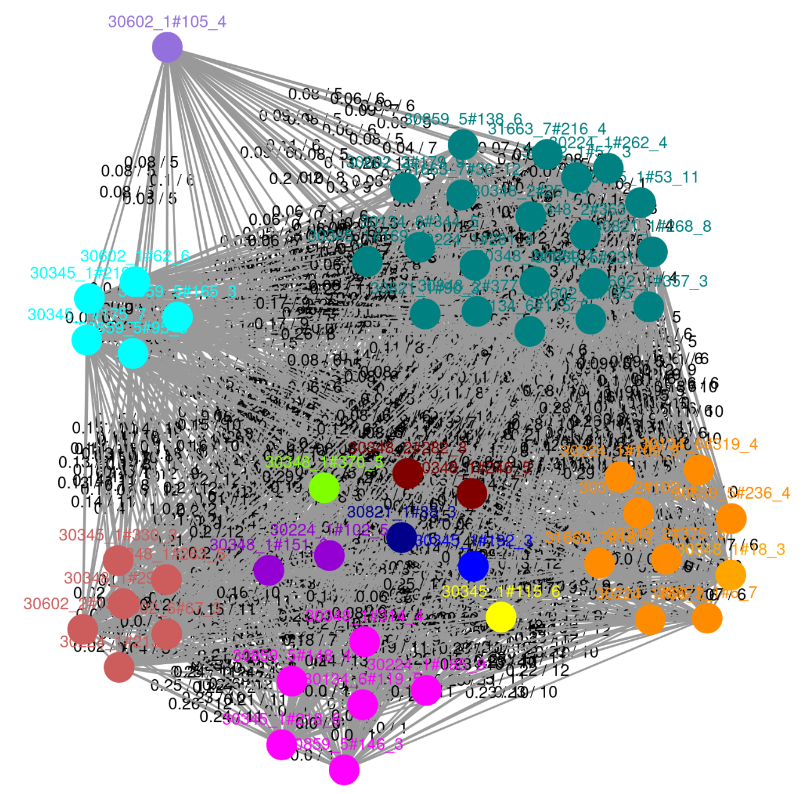
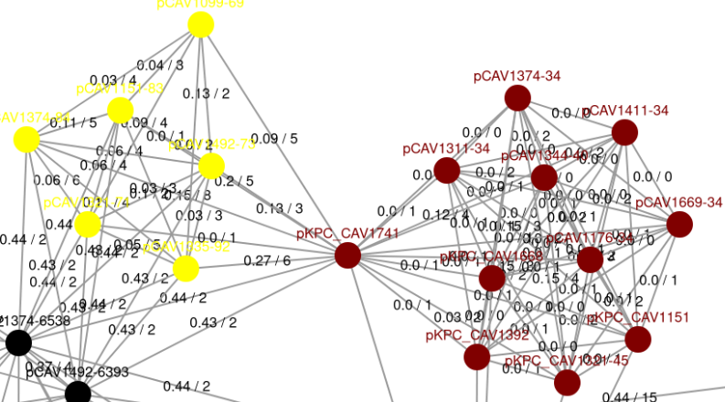
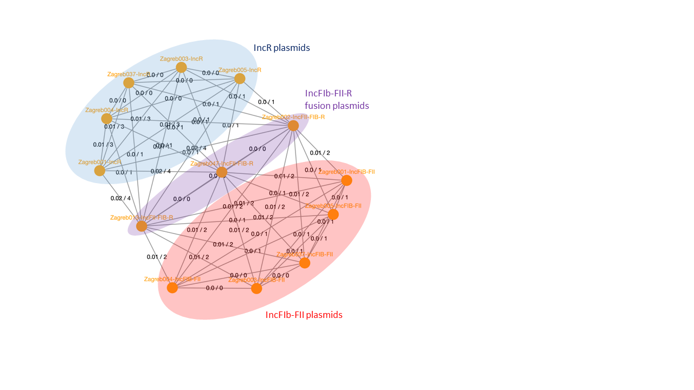
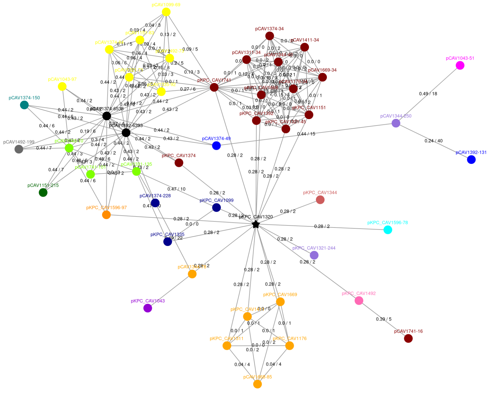

General Advice
==============

Changing thresholds
-------------------

Although the default thresholds often work pretty well, unfortunately they are not one size fits all. In pling there are two thresholds you may want to change: containment distance threshold and DCJ-Indel distance threshold.
If you are working on a small evolutionary time scale, you may want to decrease the containment threshold to 0.3. It is not in our experience so far necessary to go any lower than 0.15, especially since typically datasets on a small time scale have a high degree of sequence similarity anyway.
For the DCJ-Indel threshold, you can often get an idea of what is a suitable threshold by studying the community network visualisations, especially if the dataset isn't too big. For example, consider the network below:

   
This example is clustered at DCJ-Indel threshold 4, but the lilac, turquoise and green subcommunities only have distances of 5-7 seperating them, while those three subcommunities have distances of at least 10 to the remaining plasmids. Arguably you could join those three subcommunities together into one by setting the threshold to 7, especially if you're looking at longer evolutionary time scales.

When experimenting with DCJ-Indel thresholds, you can rerun pling with the same output directory -- a seperate folder will produced for the DCJ-Indel network and subcommunities for each threshold, and the previous integerisations and DCJ-Indel caluclations will be reused, which reduces runtimes significantly. However, if you are changing the containment threshold, make sure to use a new output folder, otherwise your results will be overwritten.

A good way to develop a feeling for how much DCJ-Indel is "little" or "a lot" is by visualising alignments between plasmids, and comparing to their distance. You can for example use this script from Martin Hunt: https://github.com/martinghunt/bioinf-scripts/blob/master/python/multi_act_cartoon.py.

Interpreting pling networks
---------------------------

In addition to the clustering, studying and interpreting the pling networks can indicate interesting evolutionary events. Here are collected a couple of examples from real data to showcase what you might want to look out for.

Example 1: Cointegrate bridging subcommunities

   
This example was also discussed in figure 4 of the pling paper. The central plasmid bridges two otherwise completely distinct subcommunities, and the distances between that plasmid and the remaining plasmids are low both in terms of containment and DCJ-Indel. This makes it a likely candidate for a cointegrate plasmid, and checking additional data such as plasmid length and Inc types, as well looking at visualisations of alignments between these plasmids, confirms this.

Example 2: Cointegrates and parental plasmids in a single subcommunity:

   
In this example, cointegrates and their parental plasmids form one subcommunity. The five leftmost plasmids are IncR plasmids, while the five rightmost are IncFIB-FII. The three in the middle are IncFII-FIB-R plasmids, which are three cointegrate plasmids formed from the fusion of the IncR and IncFIB-FII plasmids. Like in the previous example, the cointegrates bridge the parental plasmids together. In this case, rather than being split into two subcommunities, they all end up in one -- this is because there aren't enough samples from the parents and cointegrate to create distinct enough structures on the network for the clustering algorithm to pick up on them being different. This is generally something worth looking out for, if e.g. you find a pling subcommunity has no core, check Inc types or length distributions. If you find both single and multireplicon plasmids, or have a very spread out or bimodal length distribution, that may indicate the subcommunity contains both cointegrates and their parental plasmids.
(This example and figure is courtesy of Sandra Reuters)
   
Example 3: Hub plasmids

   
This example is the full community from example 1. Centrally, there is a plasmid denoted by a black star -- this is a hub plasmid. This plasmid is dominated by a transposable element, which is also present in all it's neighbours. This is typical of most hub plasmids, but sometimes hub plasmids can be very large plasmids, that are either fusions of many smaller plasmids, or have accumulated many different transposable elements. If you are interested in hubs, checking length and annotating transposons can explain why a hub plasmid has connected to so many distinct plasmids.

Note that there is currently a bug in visualisations -- hubs are supposed to be denoted by a black star, but sometimes are just visualised as black circles, e.g. the two black circles in the upper left corner are both hubs (they are discussed in figure 5 of the paper). You can double check for hubs in the ``dcj_thresh_4_graph/objects/hub_plasmids.csv`` file.

Editing pling visualisations
----------------------------

The default html visualisations pling produces are often a good starting point, but you may want to modify them for your specific needs. There are several ways you can do this:

- **Run pling with option to output Cytoscape formatted json files.** As of version 2, you can optionally output json files that can be loaded directly into Cytoscape. There is a style file at https://raw.githubusercontent.com/leoisl/plasnet/main/plasnet/ext/templates/plasnet_style.xml that is similar to the visualisation format pling uses by default, which you can load into Cytoscape. You can also use the json files with the python library networkx (see https://networkx.org/documentation/stable/reference/readwrite/generated/networkx.readwrite.json_graph.cytoscape_graph.html). It appears there are also packages in R that will load Cytoscape formatted json files, e.g. https://rdrr.io/github/BodenmillerGroup/bbRtools/man/load_json_graph.html.
- **Use the distance files and typing files to construct your own network in your language of choice.** You can find an example of this in issue #67 for R.
- **Directly edit the html files.** This is generally a bit finnicky though.

Bacterial and other non-plasmid genomes
---------------------------------------

Pling was created with plasmids in mind, but in principle it can be used with other types of genomes (as long as they are complete and single chromosome). The only issue you may run into is with computational resources. The run time bottleneck for pling is generally the integerisation step, which requires doing pairwise alignment. This is reasonably cheap for plasmids as they have small genomes, but may be more of an issue with larger genomes like bacteria. If you think doing pairwise alignment is viable for your dataset, then pling will likely run just fine.
