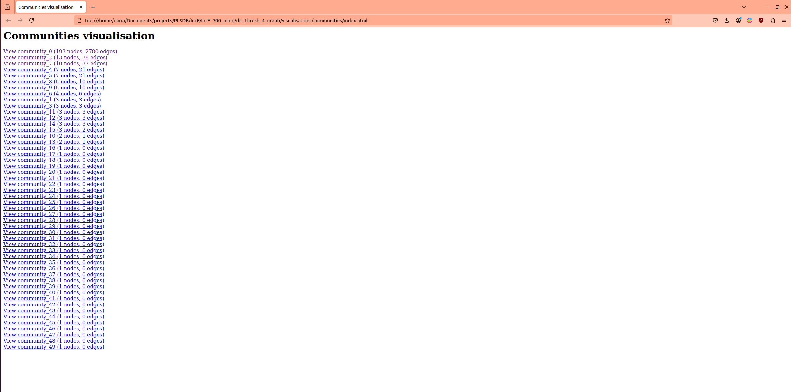
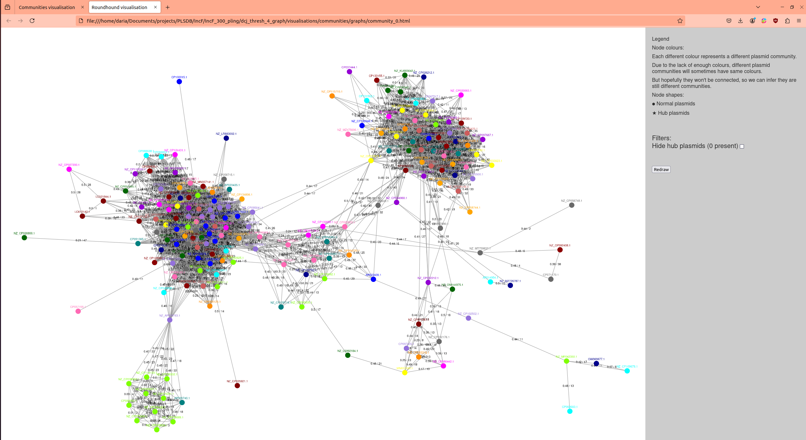
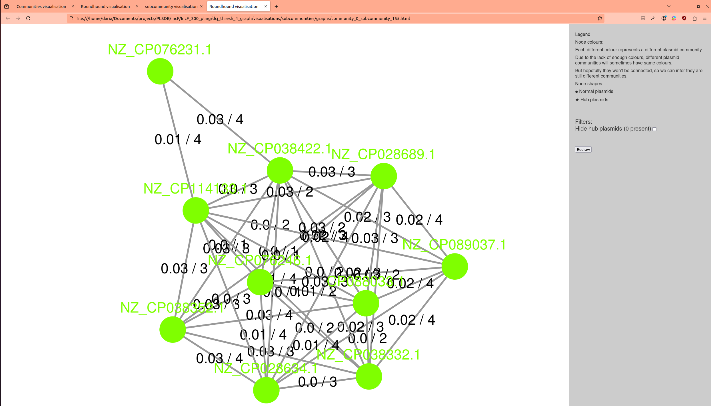

Tutorial
========

Please see installation instructions before starting.

You can test pling on 300 randomly selected plasmids from PLSDB, which can be found `here <https://figshare.com/articles/dataset/fastas_tar_xz/26808037?file=48723568>`_. Download the fastas into your working directory.

Extract the fasta files with the following command::

	tar -xvf fastas.tar.xz
	
Then generate a list of filepaths to input to pling by doing:

.. code-block:: console

	cd fastas
	ls -d -1 $PWD/*.fna > ../input.txt
	cd ..
	
To reduce runtime, in this example you are going to run pling with the sourmash prefiltering. This removes plasmid pairs with containment distance greater than 0.85 early in the workflow, to reduce the number of pairwise calculations pling needs to perform. With 8 cores, this should take roughly 25 minutes.
Decide on a name for your output directory; in this tutorial we will use ``pling_out``.
Run pling with the following command::

	pling input.txt pling_out align --cores 8 --sourmash
	
The first two arguments are the file with the list of fasta filepaths, and the output directory, both of which are required inputs. The third argument is the type of integerisation; unless you want to skip integerisation entirely, this argument will always be ``align`` (for more information on skipping integerisation, see Advanced Usage).
The remaining two arguments are optional -- ``--cores`` sets the amount of threads/cores to be used, and ``--sourmash`` is a flag that indicates pling should be run with sourmash prefiltering.

Pling will first calculate a containment network, the connected components of which define the *community* a plasmid is assigned to, after which the pling network is induced on the containment network from the DCJ-Indel distances. The *subcommunity* of a plasmid is its final type, and is found by clustering on the pling network.

In your output there will be 5 folders and one tsv file. In most cases, you will primarily be interested in the tsv file ``all_plasmids_distances.tsv`` and the folder ``dcj_thresh_4_graph``. The file contains all the DCJ-Indel distances for pairs with containment distance less than 0.5, and the folder contains all visualisations and typing information from pling.
Go into the dcj_thresh_4_graph directory -- there are two further subfolders there, ``objects`` and ``visualisations``. In ``objects``, the file ``hub_plasmids.csv`` has a list of hub plasmids found (in this dataset, the list will be empty), while the file ``typing.tsv`` is a tsv with the assigned subcommunity for each plasmid. In ``visualisations`` there will be two ``subfolders``: ``communities`` and ``subcommunities``.
Go into ``communities``, and open ``index.html``. This will open in a browser, and should look something like this

   
You can click on any of the communities on the list to be taken to a visualisation of that community's *containment* network. Each node is a plasmid, and its colour denotes which subcommunity it's assigned to. There are edges between every pair of plasmids that have a containment distance less than or equal to 0.5, and the edges are labelled by both containment distance (first number) and DCJ-Indel distance (second number). If you click on "View community_0", you should see something similar to this

   
The layout may be a bit different, as it is regenerated each time you view the community. In this example, a lot of plasmids from different subcommunities are laid out near to each other -- you can fiddle with the layout by clicking on the nodes and moving them. This view is good for exploring how different subcommunities relate to each other, but you can also view the *DCJ-Indel* network for different subcommunities. Go into the ``subcommunities`` folder, open ``index.html`` and click on the top subcommunity. 

It's similar to the community visualisations, except here plasmid pairs are joined by and edge if their containment distance is less than or equal to 0.5 *and* the DCJ-Indel distance is less than or equal to 4. The colouring of nodes is consistent with the colours in the community visualisation, so you can tell that this subcommunity is located in the lower left corner (if comparing the previous two images here).

Now try running::

	pling input.txt pling_out align --dcj 7
	
this will recalculate the subcommunities with a DCJ-Indel threshold of 7. This should run quickly (if you *don't* change the output directory!) -- this is because pling reuses the already calculated DCJ-Indel distances and communities, and only recalculates the subcommunities. You should find a new folder in your output called ``dcj_thresh_7_graph``, which will contain the visualisations and typing for DCJ-Indel threshold of 7.
